# Opportunity OS - Complete Architecture Diagrams

## Table of Contents
1. [System Overview](#1-system-overview)
2. [Component Architecture](#2-component-architecture)
3. [Data Flow Architecture](#3-data-flow-architecture)
4. [Blockchain Integration](#4-blockchain-integration)
5. [Training Workflow](#5-training-workflow)
6. [UI Component Structure](#6-ui-component-structure)
7. [Deployment Architecture](#7-deployment-architecture)
8. [Security Architecture](#8-security-architecture)

---

## 1. System Overview

```mermaid
graph TB
    subgraph "User Layer"
        USER[👤 User]
        BROWSER[🌐 Web Browser]
    end
    
    subgraph "Opportunity OS"
        subgraph "UI Layer"
            DEMO[NeuroChain Demo<br/>PyQt6 Application]
            SHELL[Opportunity Shell<br/>PySide6 Desktop]
        end
        
        subgraph "Core Layer"
            WALLET[Algorand Wallet<br/>Manager]
            TRAINER[AI Trainer<br/>Engine]
            RANKING[Ranking System<br/>& Rewards]
            BLOCKCHAIN[Blockchain<br/>Integration]
        end
        
        subgraph "Infrastructure Layer"
            DAEMON[Rust Daemon<br/>Hardware Monitor]
            WORKER[AI Worker<br/>Cython Engine]
            STORAGE[Local Storage<br/>JSON/Files]
        end
    end
    
    subgraph "External Services"
        ALGORAND[Algorand TestNet<br/>algonode.cloud]
        DATASETS[Dataset Storage<br/>CSV Files]
        GPU[GPU Hardware<br/>NVIDIA/AMD]
    end
    
    USER --> DEMO
    USER --> SHELL
    DEMO --> WALLET
    DEMO --> TRAINER
    SHELL --> WALLET
    SHELL --> DAEMON
    
    WALLET --> BLOCKCHAIN
    BLOCKCHAIN --> ALGORAND
    
    TRAINER --> DATASETS
    TRAINER --> GPU
    TRAINER --> RANKING
    
    DAEMON --> GPU
    DAEMON --> WORKER
    
    RANKING --> STORAGE
    WALLET --> STORAGE
    
    style USER fill:#6C63FF
    style ALGORAND fill:#00F5FF
    style GPU fill:#FF6B9D
```




---

## 2. Component Architecture


---

## 3. Data Flow Architecture


---

## 4. Blockchain Integration


---

## 5. Training Workflow


---

## 6. UI Component Structure


---

## 7. Deployment Architecture


---

## 8. Security Architecture

```mermaid
graph TB
    subgraph "User Space"
        USER[User]
        UI[Application UI]
    end
    
    subgraph "Application Security Layer"
        subgraph "Authentication"
            NO_AUTH[No Authentication<br/>⚠️ Current State]
            FUTURE_AUTH[Password/PIN<br/>✅ Future]
        end
        
        subgraph "Key Management"
            KEYSTORE[Keystore File<br/>data/keystore.json]
            
            subgraph "Current Implementation"
                PLAINTEXT[Plaintext Storage<br/>⚠️ Security Risk]
                JSON_FILE[JSON Format<br/>address + mnemonic]
            end
            
            subgraph "Future Implementation"
                ENCRYPTION[AES-256 Encryption<br/>✅ Planned]
                OS_KEYCHAIN[OS Keychain<br/>✅ Planned]
                HARDWARE_WALLET[Hardware Wallet<br/>✅ Planned]
            end
        end
        
        subgraph "Transaction Security"
            NO_TX[No Transactions<br/>Read-Only]
            FUTURE_TX[Transaction Signing<br/>✅ Future]
            CONFIRMATION[User Confirmation<br/>✅ Future]
        end
    end
    
    subgraph "Network Security"
        HTTPS[HTTPS Only<br/>✅ Enforced]
        TLS[TLS 1.2+<br/>✅ Certificate Validation]
        
        subgraph "API Endpoints"
            TESTNET[testnet-api.algonode.cloud<br/>Public Node]
            MAINNET[mainnet-api.algonode.cloud<br/>Public Node]
            CUSTOM[Custom Node<br/>Optional]
        end
    end
    
    subgraph "Data Security"
        subgraph "Local Storage"
            FILE_PERMS[File Permissions<br/>⚠️ Needs chmod 600]
            BACKUP[No Backup<br/>⚠️ User Responsibility]
        end
        
        subgraph "In-Memory"
            PRIVATE_KEY_MEM[Private Key in RAM<br/>⚠️ Cleared on Exit]
            MNEMONIC_MEM[Mnemonic in RAM<br/>⚠️ Temporary]
        end
    end
    
    subgraph "Threat Model"
        THREATS[Identified Threats]
        
        T1[File System Access<br/>Malware/Ransomware]
        T2[Memory Dump<br/>Debugger Attach]
        T3[Network MITM<br/>DNS Spoofing]
        T4[Phishing<br/>Fake Wallet UI]
    end
    
    USER --> UI
    UI --> NO_AUTH
    NO_AUTH -.Upgrade.-> FUTURE_AUTH
    
    UI --> KEYSTORE
    KEYSTORE --> PLAINTEXT
    KEYSTORE --> JSON_FILE
    
    PLAINTEXT -.Upgrade.-> ENCRYPTION
    PLAINTEXT -.Upgrade.-> OS_KEYCHAIN
    PLAINTEXT -.Upgrade.-> HARDWARE_WALLET
    
    UI --> NO_TX
    NO_TX -.Upgrade.-> FUTURE_TX
    FUTURE_TX --> CONFIRMATION
    
    UI --> HTTPS
    HTTPS --> TLS
    TLS --> TESTNET
    TLS --> MAINNET
    TLS --> CUSTOM
    
    KEYSTORE --> FILE_PERMS
    KEYSTORE --> BACKUP
    
    KEYSTORE --> PRIVATE_KEY_MEM
    KEYSTORE --> MNEMONIC_MEM
    
    THREATS --> T1
    THREATS --> T2
    THREATS --> T3
    THREATS --> T4
    
    T1 -.Mitigated by.-> ENCRYPTION
    T2 -.Mitigated by.-> HARDWARE_WALLET
    T3 -.Mitigated by.-> TLS
    T4 -.Mitigated by.-> FUTURE_AUTH
    
    style PLAINTEXT fill:#FF4D5A
    style NO_AUTH fill:#FF4D5A
    style FILE_PERMS fill:#FF6B9D
    style ENCRYPTION fill:#34C759
    style HTTPS fill:#34C759
    style TLS fill:#34C759
```




---

## 9. Class Diagram - Core Components


---

## 10. Task Marketplace Flow


---

## 11. Reward Distribution Model


---

## 12. Hardware Monitoring Architecture

```mermaid
graph TB
    subgraph "Application Layer"
        UI[User Interface]
        STATS_CARD[Node Stats Card]
        METRICS[Performance Metrics]
    end
    
    subgraph "Monitoring Layer"
        HW_MONITOR[Hardware Monitor]
        TIMER[QTimer<br/>2 second interval]
    end
    
    subgraph "Data Collection"
        NVIDIA_SMI[nvidia-smi Command]
        
        subgraph "GPU Metrics"
            TEMP[Temperature °C]
            FAN[Fan Speed %]
            VRAM_USED[VRAM Used MB]
            VRAM_TOTAL[VRAM Total MB]
            GPU_UTIL[GPU Utilization %]
        end
        
        FALLBACK[Fallback Values<br/>N/A if unavailable]
    end
    
    subgraph "Rust Daemon (Future)"
        DAEMON[Hardware Daemon]
        TELEMETRY[Telemetry API]
        
        subgraph "Advanced Metrics"
            CPU_LOAD[CPU Load %]
            CPU_TEMP[CPU Temperature]
            NET_LATENCY[Network Latency]
            POWER[Power Consumption]
        end
    end
    
    subgraph "Display Layer"
        TEMP_LABEL[Temperature Display]
        FAN_LABEL[Fan Speed Display]
        VRAM_LABEL[VRAM Display]
        UTIL_BAR[GPU Utilization Bar]
    end
    
    UI --> STATS_CARD
    STATS_CARD --> METRICS
    
    TIMER --> HW_MONITOR
    HW_MONITOR --> NVIDIA_SMI
    
    NVIDIA_SMI --> TEMP
    NVIDIA_SMI --> FAN
    NVIDIA_SMI --> VRAM_USED
    NVIDIA_SMI --> VRAM_TOTAL
    NVIDIA_SMI --> GPU_UTIL
    
    NVIDIA_SMI -.Error.-> FALLBACK
    
    TEMP --> TEMP_LABEL
    FAN --> FAN_LABEL
    VRAM_USED --> VRAM_LABEL
    VRAM_TOTAL --> VRAM_LABEL
    GPU_UTIL --> UTIL_BAR
    
    FALLBACK --> TEMP_LABEL
    FALLBACK --> FAN_LABEL
    FALLBACK --> VRAM_LABEL
    
    DAEMON -.Future.-> TELEMETRY
    TELEMETRY -.Future.-> CPU_LOAD
    TELEMETRY -.Future.-> CPU_TEMP
    TELEMETRY -.Future.-> NET_LATENCY
    TELEMETRY -.Future.-> POWER
    
    style NVIDIA_SMI fill:#34C759
    style DAEMON fill:#6C63FF
    style FALLBACK fill:#FF6B9D
```



---

## 13. File System Structure


---

## 14. Future Smart Contract Architecture


---

## 15. Network Communication Flow


---

## 16. Error Handling & Recovery


---

## 17. Development vs Production Architecture


---

## 18. Technology Stack Overview


---

## Summary

This comprehensive architecture documentation covers:

1. **System Overview** - High-level component interaction
2. **Component Architecture** - Detailed module breakdown
3. **Data Flow** - Sequence of operations
4. **Blockchain Integration** - Algorand SDK usage
5. **Training Workflow** - State machine for ML training
6. **UI Structure** - Component hierarchy
7. **Deployment** - Build and distribution pipeline
8. **Security** - Threat model and mitigations
9. **Class Diagram** - Object-oriented design
10. **Task Marketplace** - Task flow and selection
11. **Reward Distribution** - Payout calculation logic
12. **Hardware Monitoring** - GPU/CPU telemetry
13. **File System** - Project structure
14. **Future Smart Contracts** - Planned blockchain features
15. **Network Communication** - API interaction flow
16. **Error Handling** - Recovery strategies
17. **Dev vs Prod** - Environment differences
18. **Technology Stack** - Complete tech overview

---

## How to Use These Diagrams

### Viewing in GitHub
These Mermaid diagrams render automatically in GitHub markdown files.

### Viewing Locally
Use a Mermaid-compatible markdown viewer:
- VS Code with Mermaid extension
- Obsidian
- Typora
- Online: https://mermaid.live/

### Exporting
Convert to images using:
```bash
# Using mermaid-cli
mmdc -i architecture_diagrams.md -o architecture_diagrams.pdf

# Or use online tools
# https://mermaid.live/ -> Export as PNG/SVG
```

---

**Document Version**: 1.0  
**Last Updated**: February 20, 2026  
**Status**: Complete
